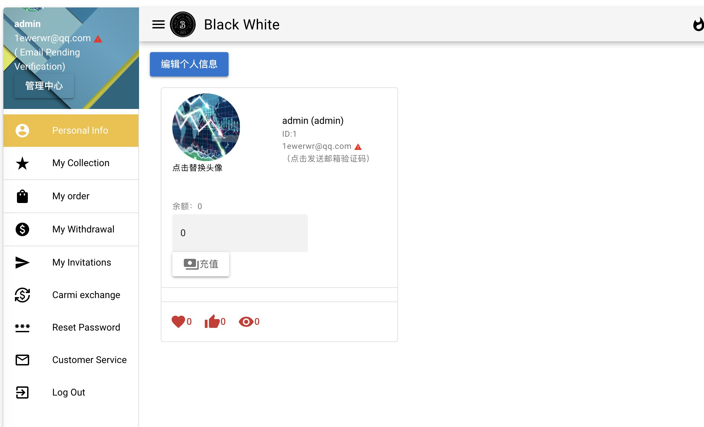

# shopping ui
商城系统，支持多店铺
基于 Quasar vue3
## 后台整理中

## Install the dependencies
```bash
yarn
# or
npm install
```

### Start the app in development mode (hot-code reloading, error reporting, etc.)
```bash
quasar dev
```


### Build the app for production
```bash
quasar build
```

### Customize the configuration
See [Configuring quasar.config.js](https://v2.quasar.dev/quasar-cli-vite/quasar-config-js).




